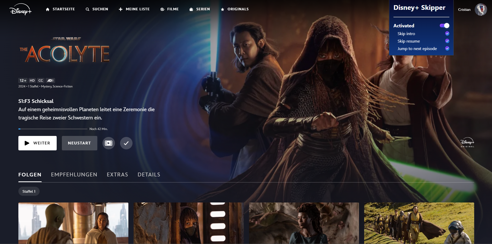
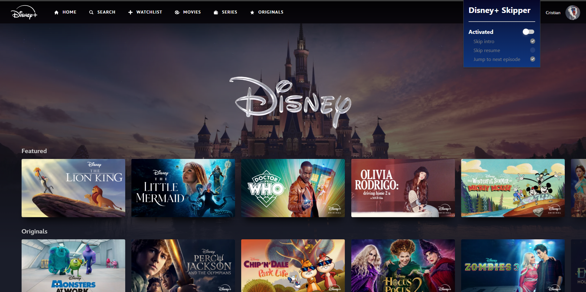

# Disney+ Skipper


## Description

**Disney+ Skipper** is a Chrome extension designed to enhance your Disney+ experience. With this extension, you can automatically skip intros, recaps, and jump to the next episode without lifting a finger.

## Features

- **Skip Intros**: Automatically skip the intros of your favorite series.
- **Skip Recaps**: Skip recaps and jump directly to the new content.
- **Jump to Next Episode**: Automatically advance to the next episode when one ends.
- **User-Friendly Interface**: Easily configure which functions you want to activate.

## Screenshots


_Extension user interface_


_Options configuration_

## Installation

1. Clone this repository or download the ZIP files.
   ```sh
   git clone https://github.com/your_username/disney-plus-skipper.git
   ```
2. Open Chrome and navigate to `chrome://extensions/`.
3. Enable "Developer mode" in the top right corner.
4. Click "Load unpacked" and select the project folder you cloned or unzipped.

## Usage

1. Open Disney+ and play any series or movie.
2. The extension will automatically activate and start skipping intros, recaps, and jumping to the next episode according to your settings.

## Configuration

1. Click on the extension icon in the Chrome toolbar.
2. Adjust the settings according to your preferences:
   - Enable/Disable skip intros
   - Enable/Disable skip recaps
   - Enable/Disable jump to next episode

## Permissions

The extension requires the following permissions to function correctly:

- **activeTab**: Allows interaction with the active tab.
- **scripting**: Allows executing scripts on the Disney+ web page.
- **host_permissions**: `https://www.disneyplus.com/*` to limit the extension to only Disney+ pages.

## Contributions

Contributions are welcome! If you want to improve this extension or add new features, please follow these steps:

1. Fork the project.
2. Create a new branch (`git checkout -b feature/new-feature`).
3. Make the necessary changes and commit them (`git commit -m 'Add new feature'`).
4. Push your changes (`git push origin feature/new-feature`).
5. Open a Pull Request.

## Credits

- **Lead Developer**: [Cristian Arias](https://github.com/titoworlddev)
<!-- - **Contributors**: [List of contributors] -->

## License

This project is licensed under the MIT License. For more details, see the [LICENSE](LICENSE) file.

## Contact

For any questions or comments, please contact [your_email@example.com](mailto:your_email@example.com).

---

Thank you for using Disney+ Skipper! Enjoy your series and movies without interruptions.
